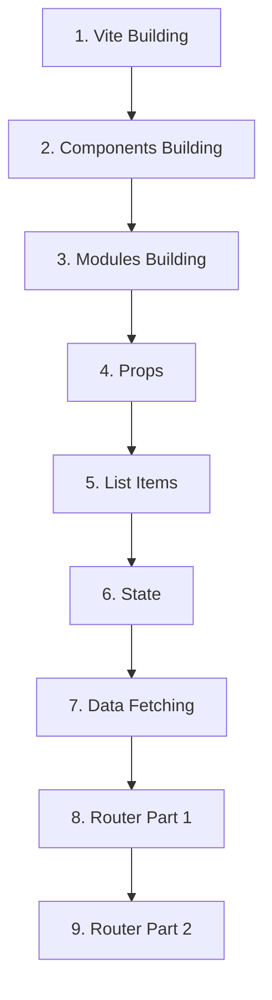

# Personal Blog Assignment Plan

## โปรเจ็กภาพรวม
สร้างเว็บไซต์บล็อกส่วนตัวด้วย React และ Vite ประกอบด้วย 9 assignments ที่ต้องทำตามลำดับ

## สถานะปัจจุบัน: 5/9 เสร็จแล้ว

| Assignment | สถานะ | หัวข้อ | Priority |
|-------------|--------|--------|----------|
| [ASSIGNMENT_1.MD](./ASSIGNMENT_1.MD) | ✅ เสร็จแล้ว | React Vite Building | Low |
| [ASSIGNMENT_2.MD](./ASSIGNMENT_2.MD) | ✅ เสร็จแล้ว | React Components Building | Low |
| [ASSIGNMENT_3.MD](./ASSIGNMENT_3.MD) | ✅ เสร็จแล้ว | React Modules Building | Low |
| [ASSIGNMENT_4.MD](./ASSIGNMENT_4.MD) | ✅ เสร็จแล้ว | React Props | High |
| [ASSIGNMENT_5.MD](./ASSIGNMENT_5.MD) | ✅ เสร็จแล้ว | React Rendering List Items | High |
| [ASSIGNMENT_6.MD](./ASSIGNMENT_6.MD) | ❌ ยังไม่เสร็จ | React State | High |
| [ASSIGNMENT_7.MD](./ASSIGNMENT_7.MD) | ❌ ยังไม่เสร็จ | React Data Fetching | High |
| [ASSIGNMENT_8.MD](./ASSIGNMENT_8.MD) | ❌ ยังไม่เสร็จ | React Router Part 1 | High |
| [ASSIGNMENT_9.MD](./ASSIGNMENT_9.MD) | ❌ ยังไม่เสร็จ | React Router Part 2 | High |

## Dependencies (การพึ่งพาระหว่าง assignments)

## Learning Path
1. **Foundation** (1-3): ตั้งค่าโปรเจ็กและโครงสร้างพื้นฐาน
2. **Core React** (4-6): การใช้งาน React concepts พื้นฐาน
3. **Advanced** (7-9): การทำงานขั้นสูงและการเชื่อมต่อภายนอก

## เป้าหมายสุดท้าย
- เว็บบล็อกส่วนตัวที่สมบูรณ์
- สามารถแสดงบทความได้แบบ dynamic
- มี routing สำหรับดูบทความแต่ละเรื่อง
- ดึงข้อมูลจาก API ได้จริง

---
*อัปเดตล่าสุด: 20 มกราคม 2026*
